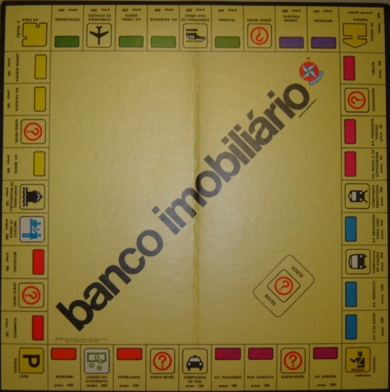

# Monopoly — PUC-Rio

Implementação do clássico jogo de tabuleiro **Monopoly (Banco Imobiliário)** em **Java Swing**, desenvolvida em 2012 como trabalho da disciplina **INF1013 — Modelagem de Software** do Departamento de Informática da **PUC-Rio** (Pontifícia Universidade Católica do Rio de Janeiro).



## 🎲 Sobre o Jogo

O jogo suporta de **2 a 6 jogadores** locais, cada um controlando um peão no tabuleiro. Cada jogador começa com **$2.458** e o objetivo é ser o último jogador solvente — quem falir é eliminado da partida.

### Funcionalidades

- **Tabuleiro completo** com terrenos de 8 cores, companhias, imposto de renda, lucros/dividendos, prisão e casas de Sorte/Revés
- **Compra e venda de propriedades** — entre jogadores ou de volta para o banco
- **Construção e venda de casas** — permitida apenas quando o jogador possui todos os terrenos do mesmo grupo de cor
- **Troca de propriedades** entre jogadores
- **Cartas de Sorte e Revés** com artes ilustradas (30 cartas: prêmios, multas, "vá para a prisão" e "saída livre da prisão")
- **Sistema de prisão** — o jogador pode sair pagando $50, tirando dados iguais ou usando a carta de saída livre
- **Pagamento de aluguel** automático ao cair em propriedade de outro jogador
- **Eliminação de jogadores** por falência, com devolução das propriedades

## 🕹️ Como Executar

### Pré-requisitos

- JDK 8 ou superior ([OpenJDK](https://openjdk.org/) via Homebrew no macOS: `brew install openjdk`)

### Compilar e rodar

```bash
cd 0620233-0620491/Monopoly

# Compilar
mkdir -p target/classes
javac -encoding UTF-8 -d target/classes $(find src -name "*.java")

# Executar (a partir da pasta Monopoly, para carregar as imagens)
java -cp target/classes br.rio.puc.inf.monopoly.Main
```

Na tela inicial, informe o nome de pelo menos 2 jogadores e clique em **"Comece o Jogo!"**.

## 🏛️ Arquitetura

O projeto segue o padrão **MVC (Model-View-Controller)** combinado com os padrões de projeto **Facade** e **Observer**:

```
src/java/br/rio/puc/inf/monopoly/
├── Main.java                  # Ponto de entrada
├── Constants.java             # Constantes do jogo (dinheiro inicial, tipos de casa)
├── facade/
│   └── MonopolyFacade.java    # Fachada de inicialização do jogo
├── controller/
│   └── GameController.java    # Regras de negócio: compra, venda, aluguel, prisão, cartas
├── model/
│   ├── Board.java             # Tabuleiro
│   ├── Pawn.java              # Peão/jogador (dinheiro, propriedades, posição)
│   ├── AbstractBoardSquare.java
│   ├── LandBoardSquare.java   # Terrenos compráveis
│   ├── PrisionBoardSquare.java
│   ├── LuckCard.java          # Cartas de Sorte/Revés
│   └── AbstractGameItem.java
├── observer/
│   ├── Subject.java           # Padrão Observer para atualização da interface
│   └── Observer.java
└── view/
    ├── PlayersFrame.java      # Tela de cadastro dos jogadores
    ├── MonopolyMainFrame.java # Janela principal do jogo
    ├── BoardView.java         # Renderização do tabuleiro
    └── LuckCardView.java      # Exibição das cartas de Sorte/Revés
```

- **Model** — representa o estado do jogo (tabuleiro, peões, propriedades, cartas)
- **View** — interface gráfica em Swing, atualizada via padrão Observer
- **Controller** — concentra as regras do jogo e notifica as views quando o estado muda
- **Facade** — simplifica a inicialização do jogo para o cliente (`Main`)

## 📐 Documentação de Design

A modelagem do sistema está disponível na pasta [`0620233-0620491/`](0620233-0620491/):

- **Diagrama de Classes** — [`DiagramaDeClasses.jpg`](0620233-0620491/DiagramaDeClasses.jpg) (fonte: `.asta`, [Astah](https://astah.net/))
- **Diagrama de Sequência** — [`Sequence Diagram.jpg`](0620233-0620491/Sequence%20Diagram.jpg)

Há também uma [especificação de modernização](docs/superpowers/specs/2026-04-03-monopoly-mobile-design.md) para uma futura versão mobile do jogo em Flutter.

## 🧪 Testes

A pasta [`0620233-0620491/Monopoly/test/`](0620233-0620491/Monopoly/test/) contém um harness de teste manual (`MainTest.java`) usado durante o desenvolvimento para exercitar o tabuleiro e a movimentação dos peões. Ele referencia uma versão anterior da API (`BoardController`) e é mantido apenas como registro histórico.

## 👥 Autores

Desenvolvido em 2012 por:

- **Ryniere Silva** — [@ryniere](https://github.com/ryniere)
- **Philip Dunker**

---

*Projeto acadêmico — INF1013 (Modelagem de Software), Departamento de Informática, PUC-Rio, 2012.*
